<h1>  FRONTEND TATTOO & PIERCING STUDIO  </h1>

**Proyecto nº 5 FRONTEND Estudio de Tatuaje del Bootcampt Full Stack Developer en GeeksHubs Academy**


# Table of Contents

- ### 🚀 [Descripcion](#descripción-del-proyecto)
- ### 🎯 [Objetivo aplicacion](#objetivo-de-la-aplicación)
- ### 👩🏽‍💻 [Tecnologias](#tecnologías)
- ### 👀 [Vistas](#vistas)
- ### 🔝 [Mejoras](#futuras-mejoras)
- ### ⚙️ [Instrucciones aplicación](#instrucciones-de-instalación-local)


## Descripción del Proyecto

Este proyecto es el frontend de un sistema de gestión de citas para un estudio de tatuajes y piercings, que complementa el backend desarrollado en el anterior proyecto en la formación del Bootcamp Full Stack Developer en GeeksHubs Academy.
 En esta aplicación, podemos registrarnos como nuevos usuarios, y loguearnos para poder acceder al resto de la aplicación.
 A la hora de realizar el login, se diferencia entre usuario y super-admin, cambiando el header dependiendo del acceso al que se está permitido, dependiendo del role al que pertenece.
 En el caso de tener un role super-admin, puede acceder a otro menú exclusivo donde puede realizar el listado de todos los usuarios, todas las citas y registrar nuevos tatuadores.
 También hay un apartado exclusivo de profesionales, en el que hay que loguearse y le permite ver sus citas.


## Objetivo de la aplicación

- Registro y login de usuarios.
- Vista de las citas del usuario con opción de seleccionar una de ellas y permitirle la edición, modificación y borrado en la misma vista.
- Funcionalidades adicionales para el superadmin.


## Tecnologías

El frontend ha sido desarrollado utilizando tecnologías como React, Redux,  Javascript, HTML, Bootstrap, CSS, GIT y GitHub.
</br>
</br>
[]()
[]()
[]()
[]()
[]()
</br>
</br>

## Vistas

A continuación se muestran algunas imágenes de las vistas del proyecto:

###- Vista de Home:
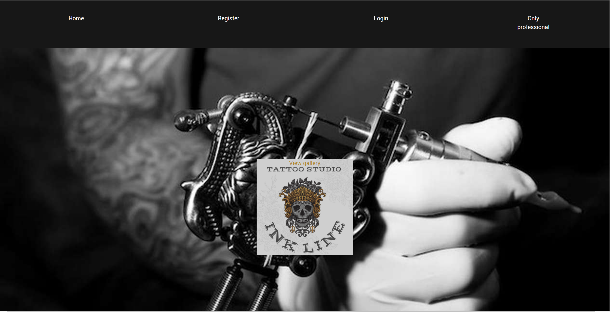
En ella se puede observar el header por defecto, donde se nos permite registrarnos como nuevos usuarios, loguearnos en caso de ya estar registrados y el acceso exclusivo para profesionales.
En el centro de la imagen, aparece el logo del estudio con un pequeño mensaje de acceso a las vistas de los trabajos. En el caso de seleccionar esta zona, accederemos a la galeria de tatuajes.

###- Vista de Galeria de tatuajes:
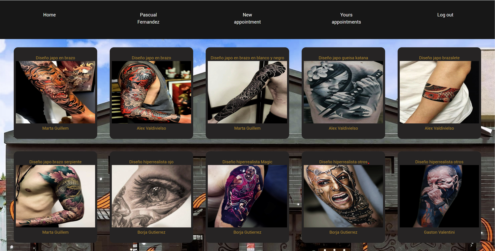
Muestra los diferentes trabajos de los tatuadores, con una pequeña descripción y el nombre del artista que realizó el trabajo.

###- Vista de Registro de Usuarios:
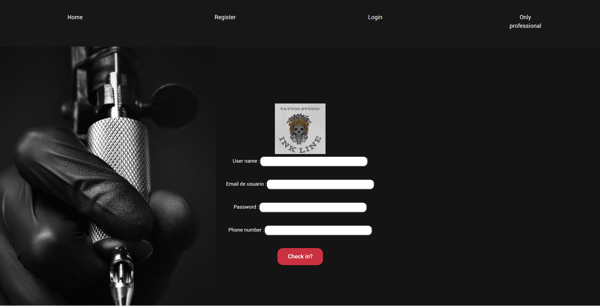
Se recogen los datos de un nuevo usuario, haciendo una validación de cada uno de los datos introducidos, y no permitiendo el registro en el caso de que no estén todos los campos correctamente completados.

###- Vista de Login de usuario:
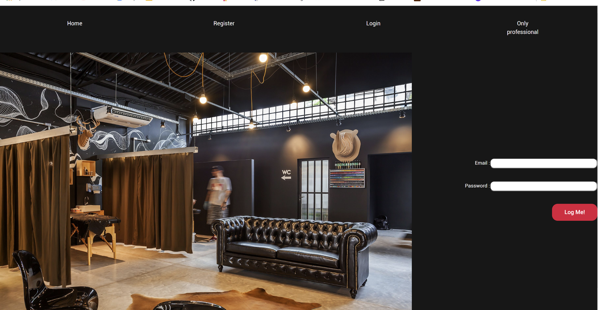
En el caso de ya estar registrado, puede realizar el login. 
Se solicita el email y contraseña, realizando las validaciones correspondientes a la sintaxis de un correcto email y a los mínimos de un correcto password. 
En el caso de resultar un usuario con rol "user", se le dará paso a una vista con un header distinto al que se le proporciona a la persona logueada con role "super-admin".


###- Vista del menu de login usuario. 

Se genera de forma particular para cada usuario logueado. Se añade el nombre de la persona logueada en el Header de la página, pudiendo acceder a sus datos pulsando su nombre.

###- Vista Crear citas:

El usuario puede crear citas con el tatuador seleccionado mediante un desplegable realizado con un select, seleccionando la fecha, turno de mañana o tarde, tipo de trabajo y una breve descripción.
En esta imagen, se pueden apreciar los diferentes mensajes de error que aparecen si los campos no son introducidos correctamente.

###- Vista de Crear citas (sin errores por validación):


###- Vista de Citas del usuario logueado:
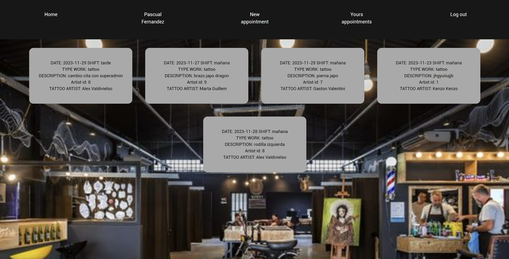
Se realiza un listado de las citas que pertenecen al usuario logueado. Se pueden seleccionar una cita para su posterior modificación.

###- Vista de mostrar cita:
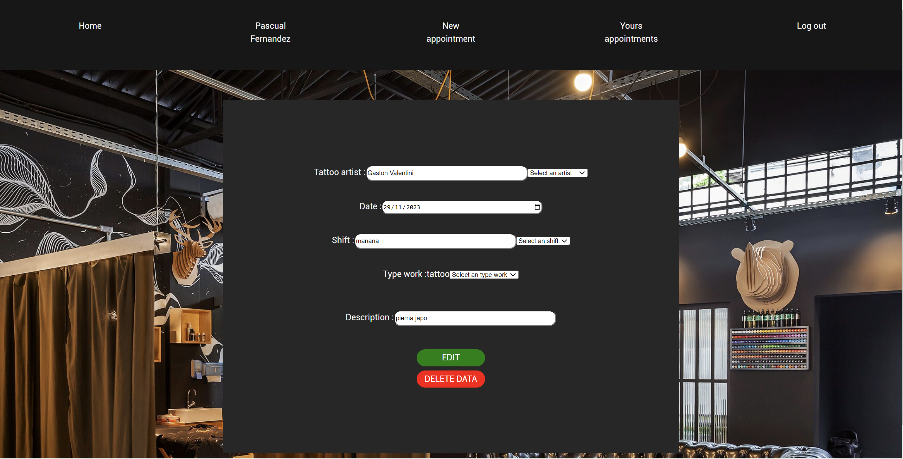
Se han incluido el profile, el update y el delete de la cita en esta vista.
Se muestra la cita al ser seleccionada en la pantalla anterior. Pulsando el boton verde EDIT, podemos acceder a la modificación de los campos y finalizar el proceso pulsando UPDATE DATA, que aparece al cambiar el estado de los datos.
Podemos realizar la eliminación de la cita pulsando el boton rojo DELETE DATA.
Se han utilizado campos para controlar el estado de los componentes, he utilizado REDUX para la lectura y escritura de la información en las diferentes vistas.

###- Vista de login Only Profesional:
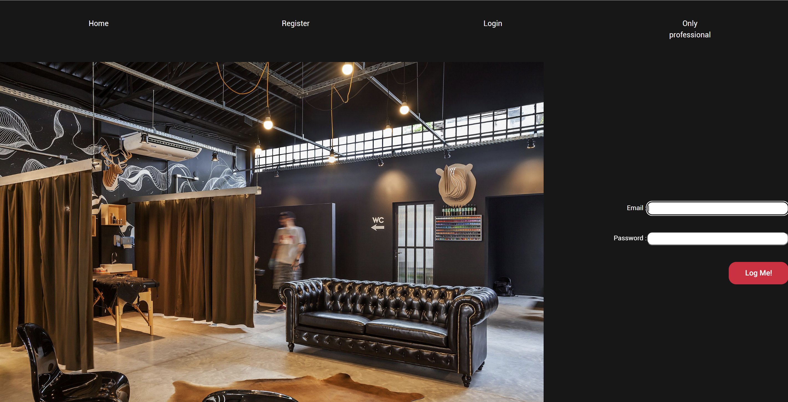
Esta vista está reservada para los tatuadores, que deberán registrarse para ver el listado de citas que tienen reservadas.

###- Vista de las citas del tatuador logueado:
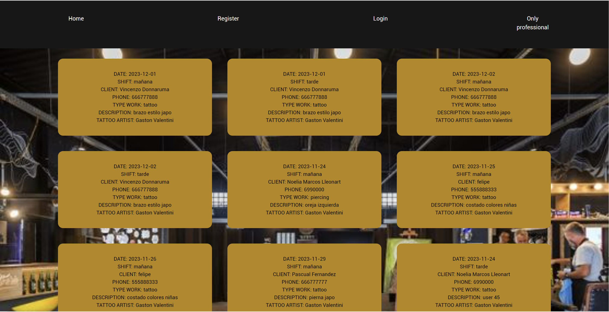
Aqui aparacen las citas que tiene reservadas el tatuador logueado anteriormente.

###- Vista del menu super-admin:
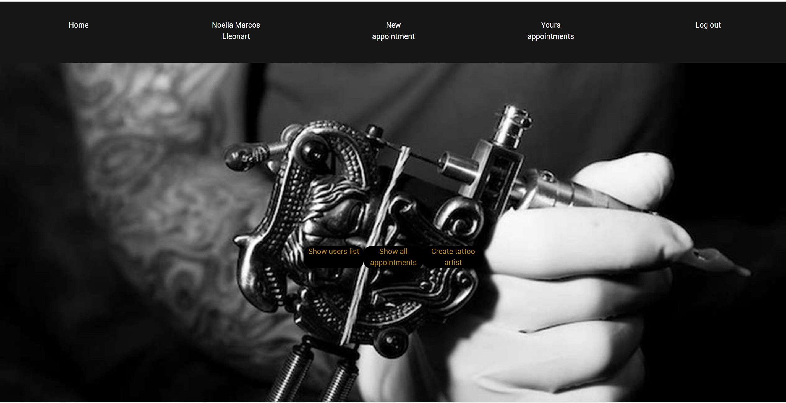
Este menú resulta del login en la pantalla principal Home, al loguearse con role super-admin.
Esta vista nos permite el acceso estas opciones como Super-admin:
  - Listado completo de usuarios.
  - Listado de toas las citas.
  - Registro de nuevos tatuadores.

###- Vista del listado de usuarios por super-admin:
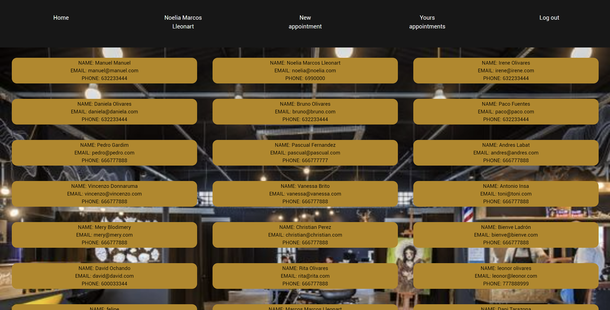
Realiza el listado de todos los usuarios de la aplicación.
El boton verde EXIT permite volver al menú de Super-admin.

###- Vista de las citas por super-admin:
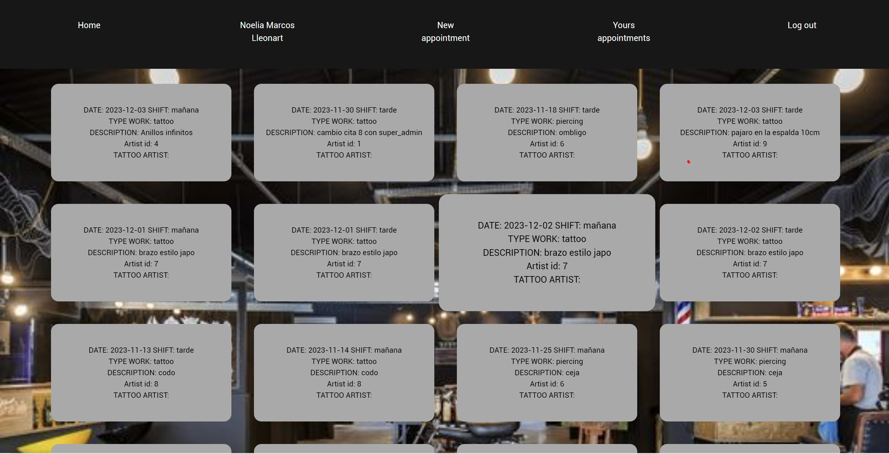
Realiza el listado de todas las citas con todos los tatuadores.
El boton verde EXIT permite volver al menú de Super-admin.

###- Vista de registro de tatuadores por super-admin:
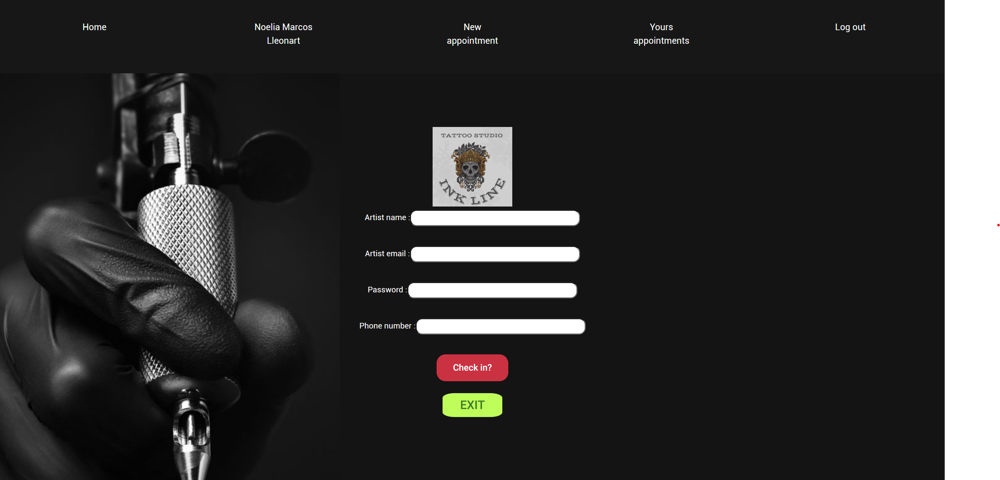
Como super-admin podemos registrar nuevos tatuadores, realizando las comprobaciones y validaciones de los datos.
El boton verde EXIT permite volver al menú de Super-admin.


## Futuras Mejoras

Este proyecto puede ser mejorado en las siguientes áreas:

- Mejorar la estetica de las vistas, incorporando tecnologias que hagan más atractiva la aplicación. Además de hacerla más responsiba y pueda utilizarse en aplicaciones móviles.
- Implementar un sistema de pagos para realizar reservas.
- Agregar funcionalidades de calendario para facilitar la gestión de citas, y que informe sobre las disponibilidades de cada tatuador. 
- Agregar funcionalidades a los tatuajes.
- Mostrar los trabajos de los tatuadores para poder seleccionarlos y crear una cita sobre ese tema del tatuaje seleccionado.
- Crear una paginación con índices, que facilite las vistas en caso de mostrarse muchos elementos.
- Tambien me gustaria implementar algunos endpoints del backend, que me parecen interesantes, y por falta de tiempo no he podido realizar.


# Instrucciones de Instalación Local

## Clonar Repositorio

1. Clona este repositorio en tu máquina local usando el siguiente comando:

```jsx
 git clone https://github.com/Noeliamll76/Proyecto-5-Frontend-Tattoo-Studio

```

## Instalación de Dependencias

1. Entra en la carpeta del proyecto:
    
    ```bash
    cd nombre_de_la_carpeta
    
    ```
    
2. Instala las dependencias utilizando npm:
    
    ```bash
    npm install
    
    ```


## Backend

Este proyecto depende del backend para su funcionalidad completa. Asegúrate de tener el backend instalado y en ejecución antes de iniciar la aplicación frontend. Puedes encontrar el código fuente del backend en el siguiente repositorio: [Backend Repository](https://github.com/Noeliamll76/Proyecto-4-Tatoo-Studio).

Sigue las instrucciones en el repositorio del backend para clonar y ejecutar el servidor.

## Ejecutar la Aplicación

1. Una vez instaladas las dependencias y con el backend en ejecución, inicia la aplicación con el siguiente comando:
    
    ```bash
    npm run dev
    ```
    
2. Abre tu navegador y visita http://localhost:3000/ para ver la aplicación en acción.

## Contribuciones

Este proyecto es público, y se aceptan las contribuciones para su mejora. Si deseas contribuir, sigue estos pasos:

1. Haz un *fork* del repositorio.
2. Crea una nueva rama para tu contribución.
3. Realiza tus cambios y mejoras.
4. Envía una *pull request* para revisión y fusión.

Gracias
